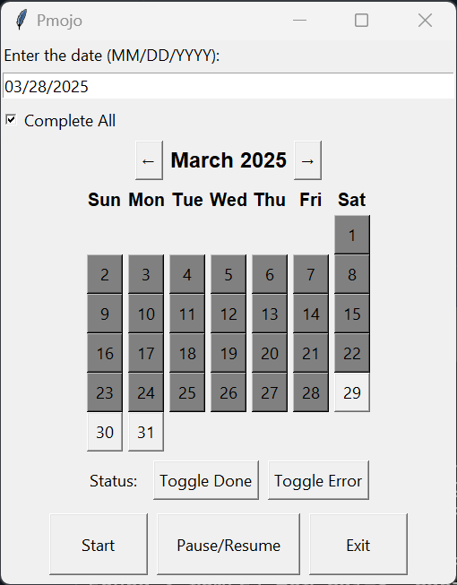

# pmojo.py - PracticeMojo → SoftDent Integration

This script automates inputting messages from [PracticeMojo](https://practicemojo.com/) into [SoftDent](https://www.carestreamdental.com/en-us/training/softdent/). Because PracticeMojo and SoftDent do not offer native intercompatibility, this script replicates what a human would do manually—fetching data from PracticeMojo and typing it into SoftDent automatically.

Originally built for **Oak Meadow Dental Center**, but it can be adapted by anyone using **PracticeMojo** + **SoftDent**.

---

## Features

- **No Hardcoded Credentials**:  
  - Stores PracticeMojo credentials in a `config.json` file, e.g.:
    ```json
    {
      "USERNAME": "myUsername",
      "PASSWORD": "myPassword"
    }
    ```
- **AHK Integration**:  
  - Uses Python’s [ahk library](https://github.com/spyoungtech/ahk) for sending keystrokes (simulating a user) in SoftDent.  
  - If you don’t already have AutoHotkey installed: pip install ahk_binary and use ahk = AHK(executable_path = "PATH").
- **Multiple Date Selection**:
  - Enter a single date and click **Start**, or check **Complete All** to fill every undone date up to that date.
- **Calendar GUI**:  
  - Highlights each day as **done** or **error**, shows “Complete All,” and updates dynamically after each day is processed.
- **Pause/Resume + Forced Exit**:  
  - **Scroll Lock**: Pause/Resume the script.  
  - **Num Lock**: Forced exit (which marks the current date as “error”).
- **SQLite Tracking**:  
  - A `days.db` file tracks date statuses (`done`, `error`, or `''` for undone).

---

## Installation

1. **Install Python 3.7+**  
2. **Install required packages**:
   ```bash
   pip install pywinauto keyboard requests beautifulsoup4
   pip install ahk_binary
   install git
   ```
3. **Install AutoHotkey**:  
   - Download from [AutoHotkey](https://www.autohotkey.com/).  
   - Install it and add it to your system PATH.
4. **Create a `config.json` file**:  
   - Create a file named `config.json` in the same directory as the script.  
   - Add your PracticeMojo credentials in the format shown above.

## Usage
1. **Open Softdent**:  
   - Open the SoftDent application and ensure it is the patient window.
2. **Run the script**:
   ```bash
   py pmojo.py
   ```
3. **GUI**:
   - Click on the calendar to select a date.  
   - Check **Complete All** to fill every undone date up to that date.
   - You can also manually enter a date in the format `MM/DD/YYYY`.
   - **Start**: Click to begin the process.
4. **Keyboard Shortcuts**:
   - **Pause/Resume**: Press **Scroll Lock** to pause/resume the script.
   - **Forced Exit**: Press **Num Lock** to stop all current processes.

## How It Works Internally

### Database (`days.db`)
- On startup, it populates a table of dates from **2020 through the Current Date**.  
- Each date is stored with a status: **“done,”** **“error,”** or `''` (empty = undone).

### GUI (`createGUI`)
- A **Tkinter window** with:
  - A **calendar**  
  - A **date entry** field  
  - A **“Complete All”** checkbox  
  - **Start** button, **Pause/Resume**, and **Exit** buttons  
- Each day’s status is **color-coded**, updated in real time (via `safe_update_calendar()`).

### Processing (`loginToSite`)
- **Logs into PracticeMojo** using `requests`, grabs message data (patient names, times, campaigns).  
- **Types** the data into SoftDent with **AHK** keystrokes.  
- **Marks** the date as done or error in `days.db`.

---

## Troubleshooting

### AHK
- If you see **"Could not find AutoHotkey.exe"**, either install AutoHotkey or specify `executable_path`.

### Scroll Lock / Num Lock not working
- The script only checks if numlock or scrolllock have been pressed every so often. If you need to exit immediately, you can press the key multiple times.

### SoftDent Window
- **SoftDent** must be on the **“patient search”** to work properly.

---

## Images


Enjoy automated data entry from **PracticeMojo** to **SoftDent**!
